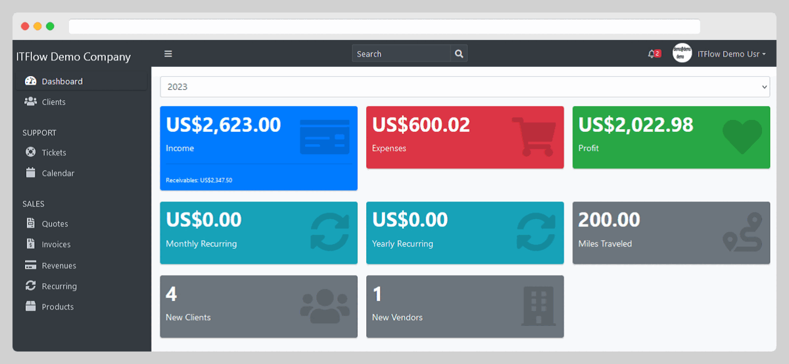

<!--
N.B.: This README was automatically generated by https://github.com/YunoHost/apps/tree/master/tools/README-generator
It shall NOT be edited by hand.
-->

# ITFlow for YunoHost

[](https://dash.yunohost.org/appci/app/itflow)  

[](https://install-app.yunohost.org/?app=itflow)

*[Lire ce readme en français.](./README_fr.md)*

> *This package allows you to install ITFlow quickly and simply on a YunoHost server.
If you don't have YunoHost, please consult [the guide](https://yunohost.org/#/install) to learn how to install it.*

## Overview

IT documentation, ticketing and accounting system for small MSPs.

**Shipped version:** 2023.10.12~ynh1

**Demo:** https://demo.itflow.org/

## Screenshots



## Documentation and resources

* Official app website: <https://itflow.org/>
* Official admin documentation: <https://docs.itflow.org/installation>
* Upstream app code repository: <https://github.com/itflow-org/itflow>
* Report a bug: <https://github.com/YunoHost-Apps/itflow_ynh/issues>

## Developer info

Please send your pull request to the [testing branch](https://github.com/YunoHost-Apps/itflow_ynh/tree/testing).

To try the testing branch, please proceed like that.

``` bash
sudo yunohost app install https://github.com/YunoHost-Apps/itflow_ynh/tree/testing --debug
or
sudo yunohost app upgrade itflow -u https://github.com/YunoHost-Apps/itflow_ynh/tree/testing --debug
```

**More info regarding app packaging:** <https://yunohost.org/packaging_apps>
